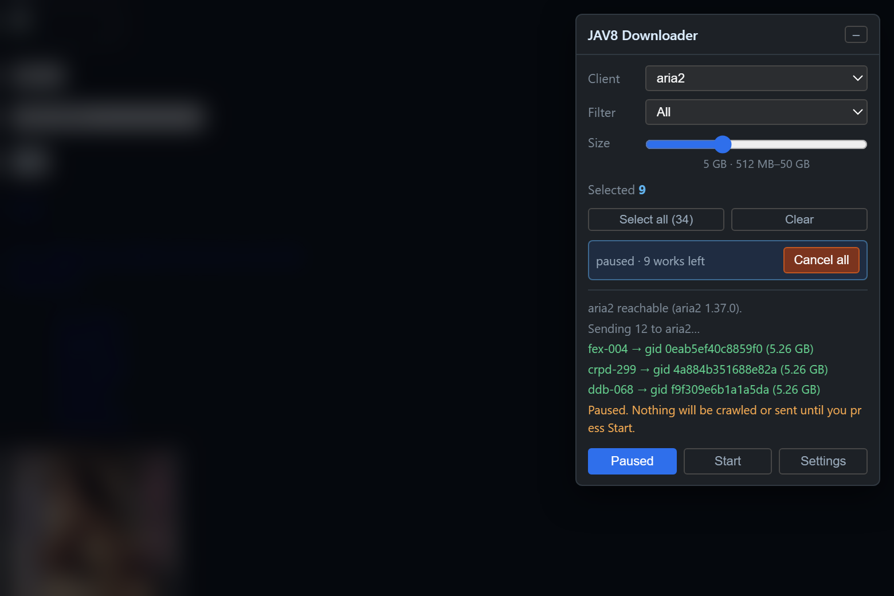

# JAV8 Downloader

> **This repo is 100% generated by AI using Opencode with the repo owner's supervision.**

A Chrome/Firefox userscript for [jav8.vip](https://jav8.vip). Tick the covers you
want, and it sends them to aria2 or qBittorrent. It picks the best magnet for
each release by size, so you get the full-quality version instead of a 200 MB
sample.



*Three works sent, nine left, batch paused. The site behind is blurred on purpose
— the panel is the whole point.*

<p align="center">
  <a href="https://github.com/mino29/jav8-dl/releases/latest">
    
  </a>
</p>

## Install

Three steps. The third is the one people miss.

1. **Install a userscript manager** — Tampermonkey or Violentmonkey. This one is
   not optional: aria2 and qBittorrent send no CORS headers, so only a manager's
   privileged request can reach them.
2. **Install the script** — open
   [`jav8-downloader.user.js`](https://raw.githubusercontent.com/mino29/jav8-dl/main/jav8-downloader.user.js)
   and accept the offer. It updates itself from then on.
3. **Tell it where your download client is** — press **Settings** in the panel and
   fill in the address. aria2 needs one option turned on before it will answer
   at all: see [below](#you-need-a-download-client-already-set-up).

Then reload any jav8.vip page and tick something.

## You need a download client already set up

**This script does not install, start or configure aria2 or qBittorrent. It only
talks to one you already have.** Set the client up yourself first — by hand, or
with one of the install guides its own project links to. Nothing here will start
a client that is not running.

### aria2 needs one extra step

Out of the box **aria2 does not answer requests at all.** Its `--enable-rpc`
option ships set to `false`, so until you turn it on there is nothing listening
on port 6800 for this script — or anything else — to talk to. Add these to
`aria2.conf`, or pass them on the command line, then restart aria2:

```ini
enable-rpc=true
rpc-listen-all=false
rpc-secret=choose-a-token
```

- `rpc-listen-all=false` binds loopback only, which is right when the browser is
  on the same machine. Set it to `true` to reach aria2 from a phone or a second
  machine — and in qBittorrent that is *Expose to local network* in
  Preferences → Web UI.
- `rpc-secret` is optional, but without one anything that can reach the port can
  queue downloads on your machine. Paste the same token into the script's
  **RPC secret** field.
- Comments in `aria2.conf` start with `#`; the lines above have none.

### Then tell the script where it is

Open **Settings** in the panel. Each field shows the vendor default as a
placeholder, and an empty field *means* "keep the default" — so you only fill in
what you have changed.

| Field | aria2 | qBittorrent |
| --- | --- | --- |
| **Host** | `http://localhost` | `http://localhost` |
| **Port** | `6800` | `8080` |
| **RPC secret** | your `rpc-secret` token | — |
| **Username** / **Password** | — | Tools → Preferences → Web UI |
| **Save dir** / **Save path** | optional; blank uses the client's own | optional |
| **Category** | — | optional; blank uses the client's own |

From a phone or a second machine, use your machine's LAN address as the Host
instead of `localhost`.

Press **Test connection** before downloading anything — it checks without saving.
**Defaults** clears every override. The script also checks for itself at the start
of every batch: if the client is not answering it says so once, names the likely
reason, and sends nothing, so a client that is down costs one request rather than
one per work.

Settings are saved in your browser only. There is no config file and nothing is
sent anywhere. The script ships with `@connect *`, so the host can be anything
your browser can reach.

| Client | Official source | Setup guide |
| --- | --- | --- |
| aria2 | [github.com/aria2/aria2](https://github.com/aria2/aria2) | [aria2.github.io manual](https://aria2.github.io/manual/en/html/index.html) |
| qBittorrent | [github.com/qbittorrent/qBittorrent](https://github.com/qbittorrent/qBittorrent) | [wiki.qbittorrent.org](https://wiki.qbittorrent.org/) |

## Use it

On any listing page a small tick box appears on every cover. Tick what you want
and press **Download selected**. VR releases get a `VR` badge.

**Each work unticks itself once it has been dealt with**, whether it downloaded
or failed, so the batch empties the selection as it runs and the `Selected 17`
counter counts down as your progress bar. There is nothing to clear afterwards.
A failure is still named in the log, and re-ticking it is one click if you want
to retry. Works you stop with **Cancel all** stay ticked, since they were never
attempted.

The panel in the top right corner holds the controls:

| Control | What it does |
| --- | --- |
| **Client** | aria2 or qBittorrent |
| **Filter** | All, VR only, or non-VR only |
| **Size** | Preferred size, on a slider |
| **Select all / Clear** | Tick everything showing, or untick everything |
| **All works** | On a performer's page: send her entire filmography |
| **＋** | On any performer link: queue her entire filmography |
| **Pause / Start** | Hold everything, or let it go again |
| **Cancel all** | Stop every crawl and download in progress |
| **Settings** | Client address, credentials, save path |

### Several tabs at once

Open as many jav8.vip tabs as you like. They share **one selection and one pause
switch**:

- Tick a cover in any tab and it is ticked in all of them, immediately.
- **Clear** in any tab clears all of them.
- **Pause** in any tab holds every tab's crawling and sending. Nothing is
  requested from the site while paused — not even the check that the download
  client is up.
- Work you tick *while a batch is already running* joins that batch. You do not
  have to press **Download selected** a second time.

A batch still belongs to the tab that started it: closing that tab stops it, and
other tabs keep their own selections.

### Pausing

**Pause** stops between items, so the next page fetch waits until you press
**Start** — mid-crawl as well as mid-download. It is a switch, not a stop: nothing
is lost, and pressing Start carries on from exactly where it was. **Cancel all**
is the one that throws work away.

### Preferred size

One slider, from 1 GB to 50 GB, defaulting to 5 GB. It picks releases between a
tenth and ten times that size, and among those it takes the one **closest to your
setting**. So with 5 GB selected and releases of 1.2 GB, 5.4 GB and 9 GB
available, you get the 5.4 GB one.

"Closest" is measured proportionally rather than in raw bytes: a 1 GB and a 9 GB
release are equally far from a 5 GB preference, because what matters is which
release is about the size you asked for.

The floor still does its original job of skipping 200 MB samples, and the
ceiling still excludes absurd multi-hundred-GB labels. If nothing fits the
window at all, the script still sends the largest real release and says so,
rather than quietly doing nothing.

### Filters

`VR only` and `non-VR only` hide the cards that do not match. **Select all**
respects the filter, so it only ticks what you can actually see. **Clear** does
the opposite and unticks everything, including what the filter is hiding, so
there is one button that always clears completely.

### Queues survive page changes

Starting a batch puts it in a queue, and the queue keeps going when you navigate
to another page or refresh. Click through to a work page and come back and it is
still sending, picking up exactly where it left off rather than starting again.
Your ticked works survive the same way, so clicking through to the next page does
not quietly empty your selection.

**Closing the tab ends that tab's queue.** Queues are kept per tab and die with
it, so nothing is left running once you close it, and a queue will not follow you
into another tab. (Your *ticks* and the *pause* switch are shared across tabs and
do outlive it — see [Several tabs at once](#several-tabs-at-once).)

A blue strip appears in the panel while anything is queued, showing what is
happening and how many works are left. **Cancel all** in that strip stops
everything at once. It only appears when there is something to stop, so it cannot
be hit by accident. Work already sent stays sent.

### A performer's whole filmography

Every link to a performer gets a **＋** button — on work pages, listings,
searches, and the performers index. Press it and the script walks all of her
pages, following pagination from page 1, applies your filter and size setting,
and queues the lot. Nothing is sent until you press **Download selected**, so you
can check the count first. A career can be a hundred works.

On `/actress/<id>` itself the panel also shows **All works**, which does the same
thing but sends immediately — you are already on her page, so there is nothing to
confirm.

### Looking after the site

Sending is deliberately gentle. The thing most likely to go wrong is not a crash —
it is getting your IP rate-limited by jav8.vip for asking too much too fast.

- Works are sent **one at a time**, never in parallel.
- There is a **short pause** between each, roughly the pace of a person clicking
  through a gallery.
- Sending **more than 25 works at once asks first**, and Cancel sends nothing.
  Under 25 it just goes, so the common case is not slowed by a dialog.
- **Only one batch runs at a time**, even when several are queued.
- **Every batch checks the client is there first**, so a client that is down costs
  one request rather than one per work — and, just as importantly, costs zero
  requests to jav8.vip, since nothing is fetched until the client answers.
- If logins start failing the batch **stops after three**. qBittorrent bans your IP
  for an hour after five consecutive failures, so carrying on would lock you out
  of your own client.

If you queue a hundred works and change your mind, press **Clear** before
sending.

## Updating

The script updates itself. Your manager checks the repository after each install
and offers the new version whenever there is one.

One rule for developers: **bump `@version` in the metadata block**, or nobody will
be offered an update and there will be no error to explain why.
`npm run check-bump` fails if you forget.

## When something does not work

The panel log says what went wrong. The usual ones:

- **"aria2 is not answering"** — the batch did not start. The client is not
  running, the address or port in **Settings** is wrong, or — the usual cause —
  aria2's `enable-rpc` is still `false`. See
  [aria2 needs one extra step](#aria2-needs-one-extra-step). This is checked once
  at the start of a batch, so it appears as a single line rather than one per
  work. Nothing was sent and nothing was unticked.
- **"Could not reach the client"** — your manager is blocking the request. Add
  the host to `@connect`, or replace it with `@connect *`.
- **"refused the request as cross-site"** — qBittorrent's CSRF protection is on.
  Turn off *Use CSRF protection* in Tools → Preferences → Web UI.
- **"refused the login"** — wrong username or password.
- **"could not read this page from jav8.vip"** — the site was slow or rate
  limiting. Nothing is wrong with your download client.

A batch stops after three failed logins on purpose. qBittorrent bans your IP for
an hour after five, so pushing on would lock you out of your own client.

## If it still misbehaves

- **Too many downloads queued at once?** Sending stops and asks when a single
  action covers more than 25 works — see [Looking after the
  site](#looking-after-the-site).
- **It is still going after I closed the page?** Queues are per tab. Closing the
  tab stops them; opening a new one starts clean. Your ticks and the pause switch
  are shared, so those come back — press **Clear** if you want them gone.
- **Nothing happens when I press Download?** Check **Pause** in any tab. It is
  shared, so a pause set in one applies everywhere, and it survives a reload.
- **My selection is empty and I only wanted some of them?** Nothing deleted it.
  Every work unticks itself once it has been attempted, so an empty selection
  after a batch means all of them were dealt with. Works that failed are named in
  the log — tick those again to retry them.
- **jav8.vip starts ignoring you?** That is rate limiting. Wait an hour; the
  script is already as gentle as it can be while still being useful.

## How it picks a magnet

Short version:

- Ignore adverts. Many magnet entries are ads; they are dimmed in the panel and
  never chosen automatically.
- Ignore anything outside your size window.
- Of what is left, take the one **closest to your preferred size**.

Adverts are recognised by markers like `▷` or words like `夸克`, plus a
deprioritised tier for names containing `@`. Nothing in this section is a guess:
it was measured against real pages, and the rules live in
[`spec/site.json`](spec/site.json).

## Development

```bash
npm test          # logic and spec checks, no browser, no network
npm run harness   # serve captured pages at 127.0.0.1:8980 for a browser
npm run verify    # icon freshness + tests + version bump, before committing
```

No dependencies and no build step. The script is a single file you install by
opening a URL, so anything that has to be compiled first would be a liability.

Fixtures under `test/fixtures/` are captured from the live site with
`python tools/fetch_fixtures.py`, never hand-written.

## Credits

Split out of `jav-scraper`, where the site knowledge was first worked out. That
project still exists and is unrelated to this one.